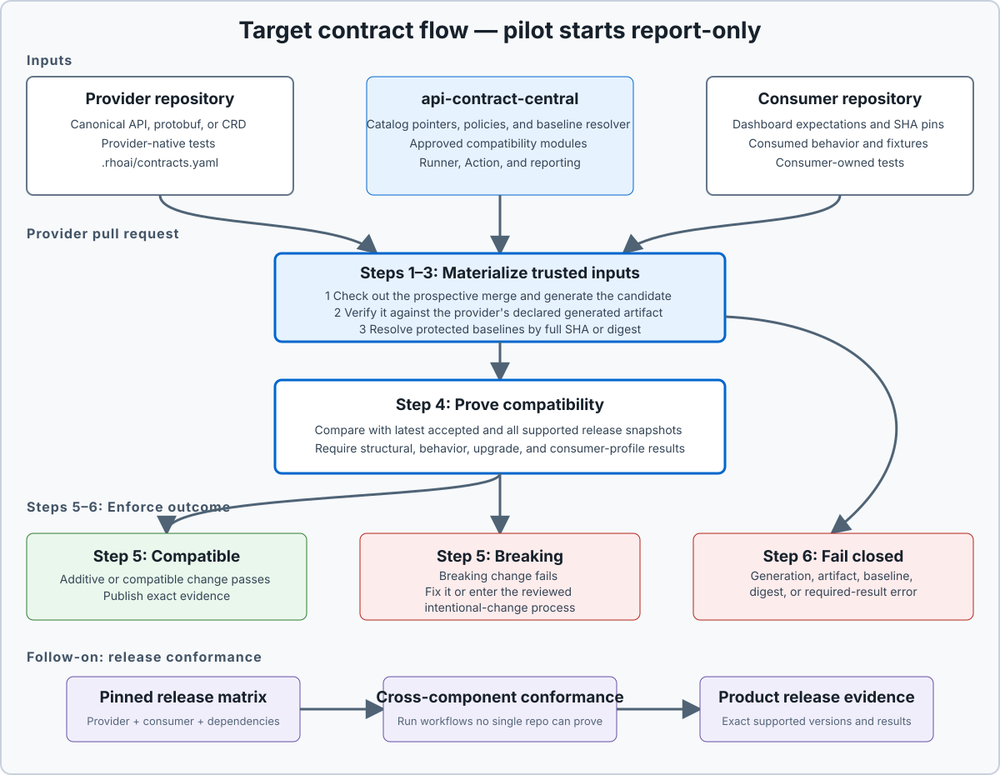

# RHOAI API Contract Working Group

## Pilot Architecture and Delivery Proposal

- **Status:** Target architecture proposal; Model Catalog pilot awaiting approval
- **Working repository name:** `api-contract-central`
- **Updated:** 2026-10-01

> **Source of truth:** The [one-page stakeholder brief](../stakeholder-brief.md) defines current
> scope, representatives, proposed dates, and success criteria. This proposal elaborates the
> operating model; the first slice is Model Catalog–Dashboard, proposed for October 5–16, 2026.

> **Pilot detail:** [Model Catalog–Dashboard API Contract Pilot](../pilot/model-registry-dashboard.md)

> **Charter:** Help RHOAI component teams own compatibility guarantees for the APIs they expose,
> and detect incompatible changes before broad integration or release validation finds them late.

## Architecture in Plain English

Think of `api-contract-central` as a shared toolbox and address book, not a warehouse for API
specifications.

- Each component team keeps its real API definition and provider tests in its own repository.
- Dashboard and other consumers record the specific behavior they depend on in their repositories.
- The API Contract testing infrastructure records where those artifacts live and supplies shared
  compatibility policy and common checks through the proposed central repository.
- A small GitHub Action runs those checks in the component's pull request.
- If a change is compatible, the pull request proceeds.
- If a change is unexpectedly incompatible, the pull request fails with a useful explanation.
- If a break is intentional, the owner supplies a reviewed migration or deprecation plan.
- A separate release job tests exact component versions together when one repository cannot prove
  the full behavior alone.

The important boundary is ownership: the component team owns the promise its API makes. The
working group governs shared rules and adoption; the API Contract testing infrastructure supplies
the policy, tooling, and pointer catalog. Dashboard is a named consumer, not the default owner of
proving every provider API is safe.

The flow below describes the target enforcement model. The first pilot starts in report-only
mode; enforcement follows stable evidence and owner agreement. Operator/CRD checks and
cross-component release conformance are follow-on work.

## End-to-End Flow

<figure class="architecture-diagram">
  
  <figcaption>Target enforcement architecture. The API Contract testing infrastructure supplies shared checks and pointers; the first Model Catalog pilot starts in report-only mode, with release conformance as follow-on work.</figcaption>
</figure>

### The six-step provider pull-request gate

> **Required invariant:** CI compares a freshly generated candidate from the pull request with
> trusted baselines outside that pull request's control. It never compares two artifacts that the
> same pull request can silently move together.

1. **Check out the change.** Test the exact prospective merge commit, not an arbitrary developer
   workspace.
2. **Generate the candidate.** Run a pinned, approved adapter against the pull-request source to
   produce a normalized OpenAPI document, protobuf descriptor, CRD bundle, or equivalent contract.
3. **Retrieve protected baselines.** Resolve the latest accepted target-branch snapshot, every
   applicable supported-release snapshot, and relevant consumer pins by full Git SHA or artifact
   digest. Resolve policy, module versions, and baseline rules from protected configuration.
4. **Compare structure and behavior.** Compare the candidate with every required baseline, verify
   it matches any committed generated artifact, and require the applicable provider behavior,
   upgrade, and consumer-profile results.
5. **Fail prohibited breaks.** Removed or narrowed behavior and any other breaking finding under
   the active support-level policy fails CI. Compatible additive changes pass this step.
6. **Fail closed on integrity drift.** Missing or failed generation, a generated/committed mismatch,
   an unresolved baseline, a digest mismatch, or missing/malformed required behavior results also
   fails CI.

The Action publishes the exact candidate digest, baseline SHAs or digests, policy, modules,
affected consumers, evidence, and remediation. In enforcement mode, the author must either make
the change compatible or complete the separately reviewed intentional-change process before the
gate can pass. The pilot and onboarding use report-only mode; the closeout recommendation and
provider/consumer agreement determine when enforcement starts.

After merge, a trusted workflow publishes the accepted contract as a new immutable snapshot.
Released component versions separately enter cross-component conformance against the supported
RHOAI matrix.

### Why this catches the important cases

| Team action | Gate result |
|---|---|
| Changes implementation and generated contract | The candidate still differs from the older protected baselines; a prohibited break fails. |
| Changes implementation but leaves a generated artifact stale | Fresh generation differs from the committed artifact; integrity drift fails. |
| Attempts to advance the baseline in the same pull request | The gate uses protected target-branch and release configuration, so the attempted move cannot make that pull request pass. |
| Changes runtime semantics not represented by the schema | Required provider behavior, upgrade, and consumer-profile checks provide the additional signal. Untested semantics remain an explicit coverage gap. |

## A Concrete Example: `opendatahub-operator`

This is a follow-on illustration of the target model, not a deliverable of the first Catalog pilot.

Think of the central repository as an inspection kit installed in each provider repository. The
provider owns the building; Dashboard supplies a usage example; the Action inspects before merge.

[`RHOAIENG-88550`](https://redhat.atlassian.net/browse/RHOAIENG-88550) was discovered after
Dashboard tried to create a `Dashboard` custom resource containing `spec.deploymentMode`. The
published CRD schema did not contain that field, the resource was rejected, and the DSC stayed
NotReady. Dashboard Cypress found a real provider contract problem, but only after the components
had been assembled in an integration environment.

Under this proposal:

1. The `opendatahub-operator` pull request invokes the shared Action.
2. The Action generates the candidate CRD from that exact pull-request source and verifies any
   committed generated CRD is current.
3. It retrieves the protected accepted and supported-release baselines.
4. A Dashboard-owned consumer fixture supplies the `Dashboard` resource shape it relies on,
   including `spec.deploymentMode`.
5. Provider-owned envtest installs the candidate CRD and submits, round-trips, and reconciles that
   fixture. A candidate schema that omits the consumed field rejects it, so the provider PR fails.
6. The team fixes the schema or completes an intentional versioned migration before merging. The
   framework catches and explains the problem; it does not automatically fix it.

```text
Today:    provider change -> integration deployment -> Dashboard Cypress fails late
Proposed: provider PR -> generate candidate + apply Dashboard fixture -> provider CI fails early
```

## Historical Evidence: Expected Earlier Detection

The [2026-08-31 Dashboard Integration Gap Analysis](../research/dashboard-integration-gap-analysis.html)
reviewed 194 `cypress_found_bug` issues and classified 132 as upstream component bugs. The 17
examples below use its symptoms, detection layers, and confidence ratings.

> **Evidence boundary:** These are expected detection paths, not proof from replaying the original
> commits. Schema diffing alone would not catch every case: runtime semantics need required provider
> tests, while genuinely cross-component behavior stays in central release conformance.

| Historical issue | Owning provider/profile | What broke | Required detector in this design | Failure point | Audit confidence |
|---|---|---|---|---|---|
| [RHOAIENG-88550](https://redhat.atlassian.net/browse/RHOAIENG-88550) | `opendatahub-operator` | `deploymentMode` rejected by the Dashboard CRD | Candidate CRD admission plus Dashboard CR fixture | Provider PR | High |
| [RHOAIENG-88547](https://redhat.atlassian.net/browse/RHOAIENG-88547) | `opendatahub-operator` | Model Registry provisioning left the DSC NotReady | Bootstrap-from-empty and reconciler-order envtest | Provider PR | High |
| [RHOAIENG-87949](https://redhat.atlassian.net/browse/RHOAIENG-87949) | `workbenches-operator` | Notebook could not start on 3.6 EA1 | Dashboard-created Notebook fixture through webhook and reconciliation | Provider PR | High |
| [RHOAIENG-87649](https://redhat.atlassian.net/browse/RHOAIENG-87649) | `model-registry-operator` | Model Catalog pods absent after fresh install | Bootstrap-from-empty to expected pods and Ready state | Provider PR | High |
| [RHOAIENG-85499](https://redhat.atlassian.net/browse/RHOAIENG-85499) | `opendatahub-operator` | Deferred DSC apply blocked by provisioning order | Reconciler dependency-order envtest | Provider PR | High |
| [RHOAIENG-82376](https://redhat.atlassian.net/browse/RHOAIENG-82376) | `odh-model-controller` | Controller CrashLoop from missing OpenShift API RBAC | Manager startup as a restricted SA using shipped RBAC | Provider PR | High |
| [RHOAIENG-83128](https://redhat.atlassian.net/browse/RHOAIENG-83128) | `feast-module-operator` | Controller forbidden from reading Notebook resources | Manager startup as a restricted SA using shipped RBAC | Provider PR | High |
| [RHOAIENG-75788](https://redhat.atlassian.net/browse/RHOAIENG-75788) | `model-registry-operator` | A PR removed required RBAC list/watch verbs | Shipped-RBAC diff plus restricted manager startup | Provider PR | High |
| [RHOAIENG-78053](https://redhat.atlassian.net/browse/RHOAIENG-78053) | `model-registry-operator` | Finalizer blocked InferenceService deletion | Adverse deletion-order and termination envtest | Provider PR | High |
| [RHOAIENG-78060](https://redhat.atlassian.net/browse/RHOAIENG-78060) | `opendatahub-operator` | TrustyAI never requeued when a dependency CRD appeared | Delayed-CRD requeue and self-heal envtest | Provider PR | High |
| [RHOAIENG-78567](https://redhat.atlassian.net/browse/RHOAIENG-78567) | KServe installation profile | KServe CRDs absent on a fresh cluster | Empty-cluster CRD install and ordering test | Provider PR | High |
| [RHOAIENG-78659](https://redhat.atlassian.net/browse/RHOAIENG-78659) | `kserve` | CRD admission rejected a production value | Candidate CRD plus real-value admission fixture | Provider PR | High |
| [RHOAIENG-76563](https://redhat.atlassian.net/browse/RHOAIENG-76563) | `model-registry-operator` | AITenant finalizer deadlocked termination | Finalizer deletion-order and termination envtest | Provider PR | High |
| [RHOAIENG-88591](https://redhat.atlassian.net/browse/RHOAIENG-88591) | `feast-module-operator` | Created namespace missed a required label | Label-propagation envtest plus consumer expectation | Provider PR | High |
| [RHOAIENG-79036](https://redhat.atlassian.net/browse/RHOAIENG-79036) | Operator + Workbenches profile | DSC could not find `odh-workbenches-config` | Pinned cross-component dependency fixture | Central conformance | High |
| [RHOAIENG-79593](https://redhat.atlassian.net/browse/RHOAIENG-79593) | Workbenches + platform operators | Duplicate Notebook webhook registration | Webhook collision policy plus multi-operator fixture | Central conformance | Low |
| [RHOAIENG-80043](https://redhat.atlassian.net/browse/RHOAIENG-80043) | MaaS + Kuadrant profile | EnvoyFilters leaked onto Dashboard gateway and caused 401s | Scoping policy plus pinned multi-gateway fixture | Central conformance | Low |

Repeated incidents strengthen the case for reusable provider checks: `RHOAIENG-66476` repeated the
Model Registry finalizer pattern, `RHOAIENG-77786` repeated the TrustyAI requeue pattern, and
`RHOAIENG-79331` repeated the Feast RBAC pattern. The Model Registry rows above concern
`model-registry-operator`; the Model Catalog HTTP/OpenAPI pilot still needs a seeded removed-
operation or removed-field replay before claiming equivalent evidence. Historical Registry
incidents retain their original component attribution.

## V1 Scope

This table describes the broader target scope. The first executable slice covers only the Model
Catalog REST v1 API consumed by the Dashboard Model Catalog BFF. Operator/CRD and multi-component
release checks are follow-on work; other interfaces require a separate scope decision.

| Contract type | V1 covers | Typical evidence |
|---|---|---|
| HTTP or gRPC service API | Operations, messages, fields, defaults, status/error semantics, and authorization behavior | OpenAPI, protobuf, runtime provider tests |
| Kubernetes API and operator behavior | CRD versions, schema, defaulting, validation, conversion, reconciliation, status, and upgrades | CRDs, N-1 fixtures, envtest/e2e results |
| Cross-repository behavior | A workflow whose guarantee spans a provider, consumer, or external controller | Pinned conformance profile and release matrix |
| External dependency adoption | Supported version range and behavior RHOAI relies on when adopting an upstream release | Adapter suite, dependency lock, named DRI |

Do not include every internal endpoint in V1. Start with supported interfaces consumed across a
repository boundary.

### What counts as breaking

A change is potentially breaking when it:

- Removes or renames an operation, message, field, API version, or endpoint.
- Narrows an accepted input or adds an incompatible required field, enum, or validation.
- Changes defaults, error/status semantics, or authorization behavior relied on by a consumer.
- Breaks CRD conversion, round-trip preservation, reconciliation, readiness, or an upgrade path.
- Moves a dependency outside its declared supported range or breaks its adapter conformance.

The checks detect changes. The API's support level and policy decide whether a detected change is
forbidden, warning-only, or allowed with an approved migration plan.

## Ownership Model

| Responsibility | Owner |
|---|---|
| Canonical OpenAPI, protobuf, or CRD source | Provider repository |
| Provider implementation and behavior tests | Provider team |
| Consumer expectations and consumer tests | Consumer repository, reviewed with provider |
| Shared compatibility policy, descriptor schemas, modules, catalog, and reporting | API Contract testing infrastructure through `api-contract-central`, governed by the working group |
| Cross-component conformance profile | Joint provider/consumer DRI |
| Supported release matrix | Productization representatives |
| Dashboard end-to-end signal | Dashboard team |

The central catalog stores repository, revision, path, owner, consumer, support-level, and
conformance-profile pointers. It must not store copied provider specifications. A central copy
would drift from the implementation and transfer ownership away from the team changing the API.

## Modular `api-contract-central`

```text
api-contract-central/
├── CHARTER.md
├── GOVERNANCE.md
├── COMPATIBILITY_POLICY.md
├── SECURITY.md
├── schemas/                 # provider descriptor, consumer profile, findings
├── catalog/                 # pointers and supported release matrices
├── policies/                # stable, preview, and experimental behavior
├── modules/
│   ├── openapi-compat/
│   ├── protobuf-compat/
│   ├── crd-compat/
│   ├── crd-upgrade/
│   ├── dependency-adoption/
│   └── result-import/
├── conformance/             # cross-repository orchestration profiles
├── cmd/rhoai-contract/      # local runner
├── actions/check/           # composable GitHub Action
├── .github/workflows/       # shortest reusable workflow
├── templates/
└── docs/onboarding/
```

### Module interface

Every module receives the same versioned input: checked-out workspace, provider descriptor,
generated candidate, immutable baseline set, changed files, policy, and execution mode. Every
module emits the same finding shape: stable rule ID, severity, location, affected consumer,
evidence, remediation, and help URL.

V1 modules are reviewed and built into a signed runner. Provider behavior tests remain in the
provider's language and CI; the central reporter can import their JSON or JUnit results. The
runner must not execute arbitrary commands supplied by pull-request-controlled configuration.

### Immutable contract baselines

The `kubeflow/notebooks` `swagger.version` mechanism is a useful starting pattern: record the exact
provider revision containing the contract a consumer supports. The design strengthens that pattern
with candidate generation, a rolling accepted snapshot, all still-supported release snapshots,
content digests, and behavior evidence.

An immutable snapshot never changes. "Updating the baseline" means publishing a new snapshot and
advancing a protected pointer to it; it never means overwriting the bytes behind an existing SHA,
version, or digest.

Two baseline classes are required:

- **Rolling accepted snapshot:** After each compatible merge to a protected provider branch, a
  trusted post-merge workflow publishes a new commit-addressed snapshot and advances
  `latest-accepted/<branch>`. The next pull request compares against it, so it cannot silently
  remove a field added after the last product release.
- **Supported-release snapshots:** Productization promotes an existing accepted snapshot into the
  supported-release matrix. Candidates remain compatible with every applicable supported release
  until its declared support window ends.

Consumer pins add evidence for specific dependencies but do not replace either required baseline
class.

### Who advances a baseline, and when

1. The provider API owner reviews and merges a candidate only after the six-step gate passes, or
   after the intentional-change process has received all required approvals.
2. A trusted post-merge workflow generates the contract again, records the provider Git SHA,
   content digest, generator version, policy, and module versions, and publishes an append-only
   snapshot.
3. That workflow advances the rolling branch pointer. A provider pull request cannot advance the
   pointer used to assess itself.
4. When a component release becomes supported, productization proposes a separate release-matrix
   change that references the already published snapshot. Affected consumer owners approve relied-
   on behavior; productization approves matrix membership; `CODEOWNERS` enforce those reviews.
5. Consumer-owned pins advance through separate reviewed consumer pull requests. An old release
   snapshot leaves the required comparison set only when its support window ends; the snapshot
   remains available for audit and reproduction.

The working group owns baseline rules, policy schemas, and exception policy. It does not approve
every ordinary compatible provider change. An intentional stable-interface break additionally
requires the migration/deprecation record, affected-consumer approval, and product/support-owner
approval.

### Drift outcomes

| Observed drift | Enforcement result |
|---|---|
| Candidate is additively compatible with all required baselines | Pass, record evidence, and publish a new rolling snapshot after merge. |
| Candidate breaks any required rolling, release, or consumer baseline | Fail and name the affected interface, release, consumer, and owner. |
| Generated candidate differs from the provider's committed generated artifact | Fail as source/specification drift. |
| Baseline is missing, mutable, unresolved, or has a digest mismatch | Fail closed as configuration or integrity drift. |
| Required behavior result is missing, malformed, or failing | Fail closed; a schema-only pass is insufficient for that contract profile. |

Different does not automatically mean failing: compatible additive evolution must remain possible.
Breaking drift and trust/integrity drift fail.

Deterministic candidate generation is mandatory. The particular generator is provider-selectable:
`swaggo/swag` can generate OpenAPI from Go annotations, another adapter can bundle a contract-first
OpenAPI source, and `controller-gen` can regenerate operator CRDs. Every adapter is approved and
pinned; the runner does not execute arbitrary commands supplied by pull-request-controlled
configuration. Structural generation still cannot prove every runtime semantic, so provider
behavior tests and explicit consumer expectations remain required where the profile calls for
them.

### Provider descriptor

The component-owned descriptor points to local sources without copying them. This is an
illustrative service descriptor, not the Catalog pilot's confirmed paths, support level, or
generator selection:

```yaml
apiVersion: contracts.rhoai.io/v1alpha1
kind: ContractSet
metadata:
  name: example-service
spec:
  supportLevel: stable
  candidate:
    generator:
      module: openapi.bundle
      version: 1.0.0
      inputs: [api/openapi/src/service.yaml]
    declaredArtifact: api/openapi/service.yaml
  baselines:
    rolling:
      strategy: target-branch-latest-accepted
    releases:
      strategy: all-supported
  contracts:
    - id: example-service-rest
      type: openapi
      source: api/openapi/src/service.yaml
      policy: stable-v1
      modules: [openapi.breaking-diff, openapi.policy]
```

Contract location, contract type, baseline, and policy remain independent. The framework does not
infer where an artifact lives from the component it tests.

## Simple Team Onboarding

1. Run `rhoai-contract init` to discover API descriptions or CRDs and scaffold the descriptor.
2. Select and pin an approved deterministic generator adapter and declared output artifact.
3. Confirm owner, support level, baseline set, policy, and selected modules.
4. Add the reusable workflow in `report` mode.
5. Register a pointer to the descriptor in the central catalog.
6. Review named consumer expectations with the consumer team.
7. Seed one incompatible change and one stale-generated-artifact change to prove both failure paths.
8. After an agreed report-only period, pin the approved runner and policy and enable enforcement.

The shortest GitHub integration is one job:

```yaml
jobs:
  api-contract:
    permissions:
      contents: read
    uses: opendatahub-io/api-contract-central/.github/workflows/provider-check.yml@v0
    with:
      contract-set: .rhoai/contracts.yaml
      mode: report
```

Repositories needing custom job ordering can call
`opendatahub-io/api-contract-central/actions/check@v0` after checkout. The same engine runs locally:

```bash
rhoai-contract check --contract-set .rhoai/contracts.yaml --mode report
```

The readable `v0` tag illustrates report-only onboarding. The Catalog pilot uses a pinned OpenAPI
check; the full reusable runner/workflow above is target tooling. Required workflows must pin the
approved commit or signed image digest and receive explicit update pull requests.

## Pilot Cohort

The first pilot is the Model Catalog service consumed by Dashboard. The broader cohort includes
`opendatahub-operator` and `workbenches-operator` as follow-on providers; their modules and profiles
are not required in the first two-week slice.

### Model Catalog: first service API pilot

- Generate or bundle the candidate OpenAPI artifact from the pull-request source on every run,
  then verify it against any committed generated artifact.
- Compare it with the rolling accepted snapshot and every applicable supported-release snapshot.
- Check removed operations/fields and incompatible input, default, response, status, error, and
  authorization changes.
- Run provider-native response conformance for the Dashboard-used subset.
- Keep a Dashboard-owned profile of the operations and semantics its BFF/client consumes.
- Cover model/version list and lookup, pagination, not-found, and authorization behavior as
  described in the stakeholder brief; confirm their mapping to Catalog operations and fixtures.
- Confirm the Catalog OpenAPI source/output paths, generation target, wire API version, and
  supported-release revision before implementation; see the [pilot detail](../pilot/model-registry-dashboard.md).
- Prove the path with additive, incompatible, and stale-generated-artifact changes in report mode.

### `opendatahub-operator`: follow-on CRD and upgrade behavior

- Regenerate candidate CRDs from the pull-request Go types with the provider's pinned generation
  adapter and fail when they differ from committed CRD YAML.
- Compare the generated CRDs with rolling and supported-release snapshots, served/storage versions,
  conversion configuration, and N-1 fixtures.
- Check type, required-field, enum, default, validation, version, and conversion compatibility.
- Import provider-owned reconciliation, status/readiness, and upgrade results.
- Keep Dashboard expectations for the DSC/DSCI fields and conditions it reads.
- Prove the path with a removed consumed field, tightened validation, or broken version conversion.

### `workbenches-operator`: follow-on cross-repository Notebook integration

- Regenerate the provider-owned Workbenches CRD and related candidate artifacts from pull-request
  source; fail generated/committed drift before compatibility analysis.
- Use webhook, RBAC, dependency range, fixtures, rolling and supported-release snapshots, and native
  behavior tests.
- Reference canonical Notebook and external dependency artifacts; do not copy their schemas.
- Exercise Dashboard-created Notebook create/update fixtures through webhook and reconciliation
  behavior.
- Check required annotations, labels, mutation, readiness, and delete behavior.
- Run a central conformance profile against pinned Workbenches, Notebook, Kueue, and Dashboard
  revisions.
- Prove the path with a validation or webhook change that rejects or incompatibly mutates a
  Dashboard fixture.

Dashboard participates even though the component tracker primarily lists suppliers: the key
consumer must have an explicit expectation and conformance role.

## External Dependency Adoption

For dependencies such as Kueue or OGX, the RHOAI-owning repository must:

1. Declare the supported version or range.
2. Maintain an adapter/integration suite for the behavior RHOAI uses.
3. Run that suite when a dependency update is proposed.
4. Fail the adoption before integration if the suite breaks.
5. Name a DRI and escalation route for upstream incompatibility.

The goal is early detection and an explicit adoption decision, not preventing an external project
from changing.

## Enforcement and Intentional Change

Use three enforcement points:

1. **Provider pull request:** compatibility checks for a provider-owned change.
2. **Intentional breaking change:** reviewed migration/deprecation record naming consumers, dates,
   support level, release target, and DRI.
3. **Release conformance:** supported provider, consumer, and dependency versions run together.

Exceptions require an owner, rationale, issue, expiry, and provider/consumer approval. The policy
for stable, preview, and experimental interfaces may differ, but every change is detected and
recorded.

## Proposed Two-Week Thin Slice

**Proposed execution: October 5–16, 2026.** This slice implements only the Model Catalog–Dashboard
boundary. The recommendation is proposed for October 16; pilot approval and dates remain pending.

### Week 1: Agree and scaffold

- Confirm execution responsibilities for Edson Tirelli / Model Catalog and Anthony Coughlin /
  Dashboard, using the representatives named in the brief.
- Confirm the Catalog source/output paths, generator, consumed wire API version, support level,
  and protected branch and supported-release baselines with productization.
- Integrate a pinned report-only OpenAPI check and register the provider contract pointer.
- Add the Dashboard provider-facing Catalog consumer profile and bounded behavior checks.

### Week 2: Execute and decide

- Run compatible, breaking, and stale-generated-artifact scenarios on the Catalog boundary.
- Validate feedback on at least one real provider pull request.
- Verify results are reproducible locally and arrive in under five minutes without a cluster.
- Publish a scorecard, outstanding gaps, reusable onboarding template, and an
  enforce/continue-reporting recommendation.

## Pilot Success Measures

- Seeded incompatibilities and stale generated artifacts are detected with actionable feedback.
- An additive change passes the checks.
- Feedback arrives in under five minutes without a cluster.
- Results are reproducible locally using the same protected baselines and policy as CI.
- At least one real pull request runs without an unexplained false block.
- Closeout provides a scorecard, reusable onboarding template, and an enforce/continue-reporting
  recommendation. Enforcement follows stable report-mode evidence and owner agreement.

Fresh generation, immutable baseline evidence, and the pointer-only catalog remain architecture
requirements. Operator onboarding and exact-revision cross-component release evidence are
follow-on goals, not first-pilot exit criteria.

## Initial Roles and Open Decisions

| Role | Proposed representative / commitment |
|---|---|
| Facilitation | Edson Tirelli |
| Consumer profile and tests | Anthony Coughlin / Dashboard |
| Provider implementation and checks | Edson Tirelli / Model Catalog |
| Supported-release baseline | Rishab Prasad / Radim Kubis; confirm provider revision |

The first pilot still needs approval, confirmation of the Catalog contract details and
supported-release revision, and acceptance of the proposed October 5–16 dates. Its provider and
consumer representatives are already named in the stakeholder brief. The broader operating model
still needs a final infrastructure repository name, support-level definitions, exception review,
and a release matrix. Operator/CRD checks and cross-component release conformance are follow-on
work; other interfaces require a separate scope decision.

## Guardrails

- Keep canonical provider contracts and provider tests beside their implementations.
- Keep the central catalog pointer-only.
- Generate a normalized candidate from pull-request source on every run; do not trust a stale
  committed artifact as the candidate.
- Resolve baseline selection, generator policy, and enforcement policy from protected target-branch
  configuration. A pull request cannot weaken the checks used to assess itself.
- Publish baselines only through trusted post-merge or release workflows and verify full SHAs or
  content digests.
- Treat schema checks as one compatibility signal, not the complete guarantee.
- Keep Dashboard full end-to-end tests out of the provider pull-request gate.
- Pin required CI tooling and policy revisions.
- Allow only reviewed modules; treat descriptors and test output as untrusted input.
- Run cross-component scenarios in disposable, quota-limited environments without production
  credentials.
- Make exceptions explicit, reviewed, auditable, and time-limited.

## Sources

- [One-page stakeholder brief](../stakeholder-brief.md) — authoritative current scope,
  representatives, proposed dates, and success criteria.
- [Model Catalog–Dashboard pilot detail](../pilot/model-registry-dashboard.md)
- Recent RHOAI API Contract Layer working-group notes supplied with this proposal.
- [Dashboard Integration Gap Analysis](../research/dashboard-integration-gap-analysis.html)
- [`kubeflow/notebooks` Swagger reference architecture](https://docs.google.com/presentation/d/1nKnsVGBL92mnXu8chWMxd9VLt1wgu7fRarrimVqMQbo/edit?slide=id.g379a97894cb_2_1095#slide=id.g379a97894cb_2_1095)
- [`opendatahub-io/model-registry`](https://github.com/opendatahub-io/model-registry)
- [`opendatahub-io/opendatahub-operator`](https://github.com/opendatahub-io/opendatahub-operator)
- [`opendatahub-io/workbenches-operator`](https://github.com/opendatahub-io/workbenches-operator)
